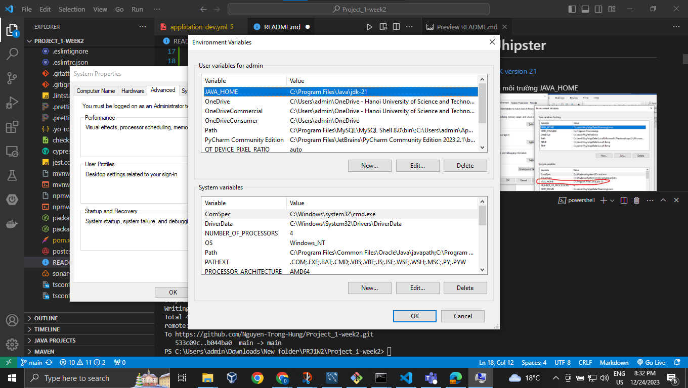
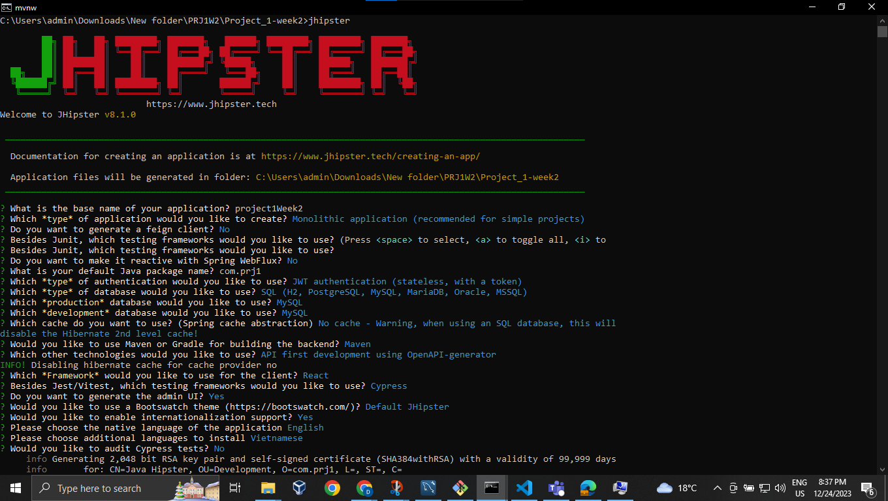
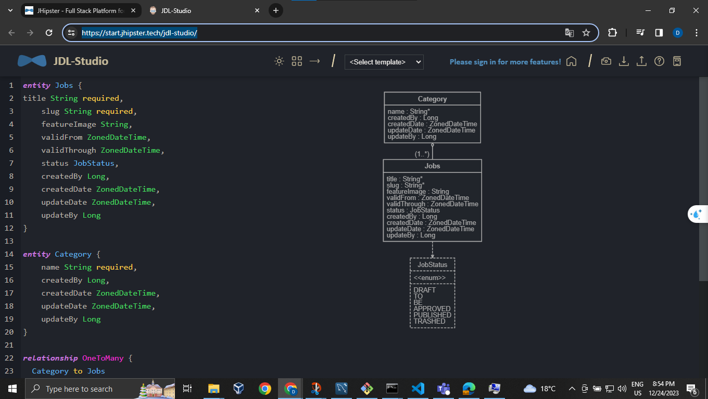
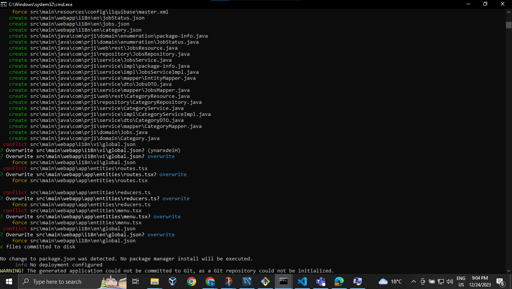
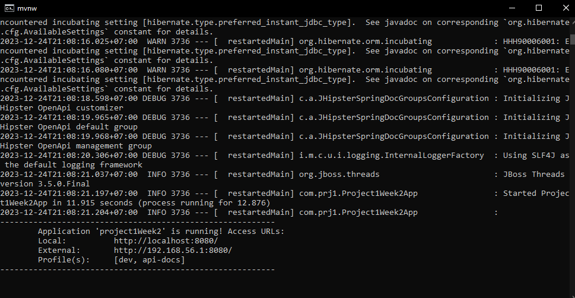
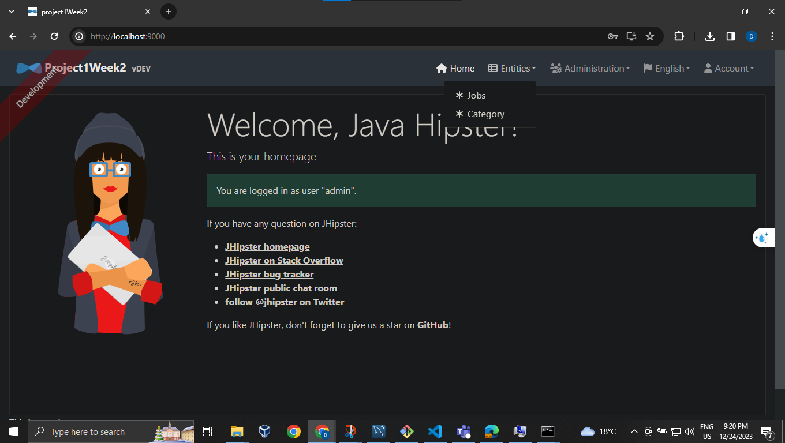
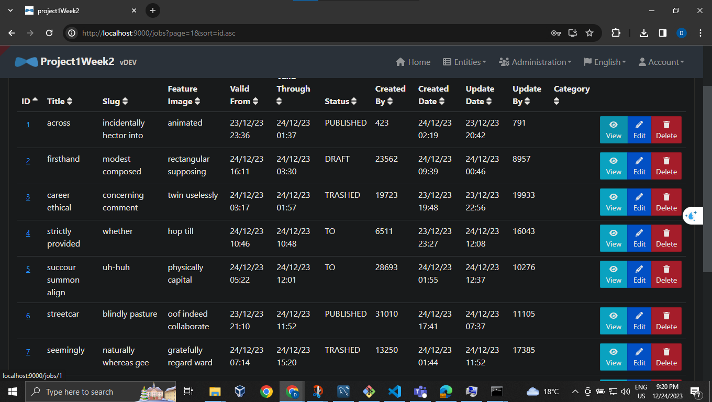
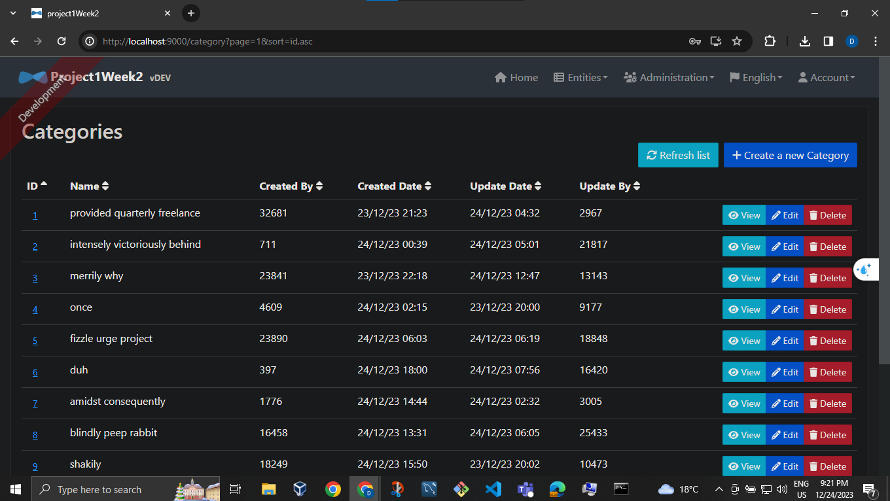

# Project_1-week2

# Khái niệm

JHipster là một trình tạo mã cấp cao được xây dựng dựa trên một danh sách phong phú các công cụ và nền tảng phát triển tiên tiến.
Các thành phần chính của công cụ là: \

- Yeoman, một công cụ giàn giáo phía trước
- Old Good Spring Boot
- AngularJS, framework Javascript nổi bật. JHipster cũng làm việc với AngularJS 2
  JHipster tạo ra, chỉ với một vài lệnh shell, một dự án web Java chính thức với giao diện người dùng thân thiện, đáp ứng, REST API được lập thành văn bản, phạm vi kiểm tra toàn diện, bảo mật cơ bản và tích hợp cơ sở dữ liệu! Mã kết quả được nhận xét tốt và tuân theo các phương pháp hay nhất của ngành.\
  Các công nghệ chính khác được nó tận dụng là:
- Swagger, cho tài liệu API
- Maven, Npm, Yarn, Gulp và Bower với tư cách là quản lý dependency và xây dựng công cụ
- Jasmine, Protractor, Cucumber và Gatling làm khung thử nghiệm
- Liquibase để lập phiên bản cơ sở dữ liệu

# Cài đặt Jhipster

1. Cài đặt
   [JDK version 21](https://www.oracle.com/java/technologies/downloads/)

   Thêm biến môi trường JAVA_HOME
   

2. Cài đặt Nodejs version 18.18.2
   [Download](https://nodejs.org/download/release/v18.18.2/)
3. Cài đặt Git
   [Download Git](https://git-scm.com/downloads)
4. Cài đặt generator-jhipster
   `npm i -g generator-jhipster@8.1.0`

# Demo Tạo 1 Project bằng Jhipster sử dụng MySQL

1. Tạo Project
   ```
   mkdir Project_1-week2
   cd Project_1-week2
   jhipster
   ```
   
2. Tạo file jdl trên JDL-studio của trang chủ Jhipster

   Viết dữ liệu trên [JDL Studio](https://start.jhipster.tech/jdl-studio/)
   
   Sau đó xuất thành file jdl rồi chuyển vào folder của source code

   Chạy lệnh `jhipster jdl jhipster-jdl.jdl` (jhipster-jdl.jdl là file vừa tải)

   Trong quá trình chèn file jdl sẽ có conflict thì sẽ ghi đè toàn bộ
   

3. Tạo Database và connect với Database

   [Tải MySql](https://dev.mysql.com/downloads/workbench/)

   Chạy lệnh `mvnw` để chạy phần backend
   Nếu chạy thành công như hình dưới là đã kết nối thành công

   
   Chạy `npm start` để khởi động FrontEnd

   Hình minh họa
   
   
   

# Ưu điểm

Tạo ra một ứng dụng web đa nền tảng một cách nhanh chóng: JHipster cho phép bạn tạo ra một ứng dụng web đa nền tảng bằng cách kết hợp các công nghệ phổ biến như Spring Boot, Angular và React. Điều này giúp giảm thời gian phát triển và tăng tốc độ đưa sản phẩm ra thị trường.\
Mã nguồn mở và cộng đồng hỗ trợ mạnh mẽ: JHipster được phát triển dựa trên mã nguồn mở và có một cộng đồng lớn ủng hộ. Người dùng có thể tìm thấy nhiều tài liệu, hướng dẫn và module mở rộng từ cộng đồng này, giúp giải quyết các vấn đề và tối ưu hóa ứng dụng của mình.\
Tích hợp sẵn các công nghệ mạnh mẽ: JHipster đã tích hợp sẵn các công nghệ mạnh mẽ như JPA, Spring Security và Liquibase, giúp xây dựng ứng dụng có tính bảo mật cao và quản lý cơ sở dữ liệu dễ dàng.

# Nhược điểm

Khả năng tùy chỉnh hạn chế: JHipster cung cấp một số lựa chọn cho việc tạo ứng dụng, nhưng không cho phép tùy chỉnh toàn diện. Điều này có thể làm hạn chế khả năng thích ứng với các yêu cầu đặc biệt của ứng dụng.\
Đòi hỏi kiến thức sâu về các công nghệ liên quan: JHipster tích hợp nhiều công nghệ và framework khác nhau, điều này có nghĩa là người phát triển cần có kiến thức sâu về các công nghệ này để sử dụng JHipster một cách hiệu quả. Điều này có thể tạo ra một ngưỡng đầu vào cao cho người mới học.\
Cấu hình phức tạp: JHipster có thể có một cấu hình phức tạp vì nó tích hợp nhiều công nghệ và framework. Điều này có thể làm tăng thời gian cấu hình và gặp khó khăn trong việc xử lý lỗi và sửa lỗi.\
Khó khăn trong việc cập nhật phiên bản mới: Vì JHipster tích hợp nhiều công nghệ và framework, việc cập nhật lên phiên bản mới có thể gặp khó khăn và có thể yêu cầu nhiều công sức và thời gian để thích ứng với các thay đổi.
